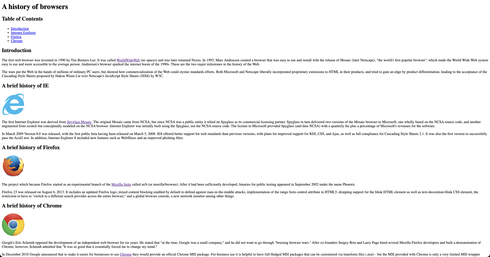
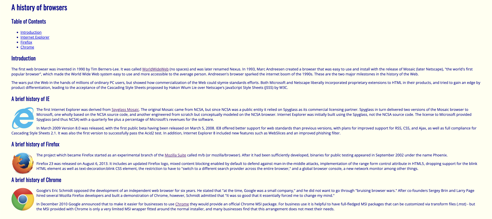
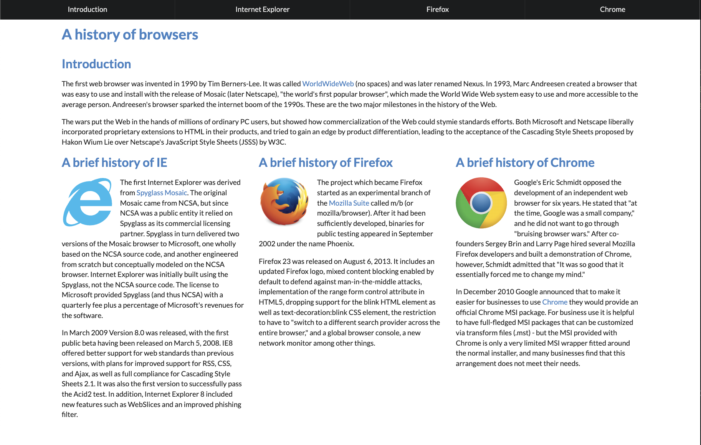

## First
  Let's start with a UI framework. In this article, we will be using Semantic UI, a front-end development framework designed for theming. The benefit of using a framework rather than raw HTML and CSS is that it contains pre-built semantic components that help create beautiful and responsive layouts using easy-to-read HTML. Semantic UI does this by using [Concise HTML, Intuitive Javascript, and Simplified Debugging](https://semantic-ui.com), allowing anyone to start creating a website with minimal knowledge.

## Less is more
  So what is the difference between using HTML, CSS, and Semantic UI? Well let us visually see the differences:

### Website 1: HTML

The first website was created only using HTML (very bland and boring!) HTML allows you to add content and the structure of web content. It only includes text, links, and photos.

### Website 2: HTML + CSS

Now a bit better, but still bland! It uses HTML and CSS, where CSS is used to style and layout web pages, such as altering the fonts, colors, sizes, spacing, etc... In website 2, CSS adds floating images, adjusts the background color to a yellowish off-white, and changes the spacing. 

### Website 3: Semantic UI

Website 3 uses Semantic UI, which is gorgeous (compared to the others). In addition to looking better and having a navbar, it also simplifies the HTML code and offers you better performance with fewer lines of code. 

For instance, the nav bar ONLY USES 6 LINES!!!!
```c
<div class="ui fixed top inverted four item menu" id="navbar">
 <a class="item" href="#Intro">Introduction</a>
 <a class="item" href="#IE">Internet Explorer</a>
 <a class="item" href="#Firefox">Firefox</a>
 <a class="item" href="#Chrome">Chrome</a>
</div>
```

## Recreating Nike.com


This is an example of a mock website of nike.com that I created as a homework assignment for ICS314 using semantic UI. When designing this website, I ran into many problems, such as using containers, grids, and aligning text and images. I thought the documentation was bland for the said classes, and I couldn't grasp the concepts and applications. This caused me to use a lot of margins and padding adjustments that didn't quite scale right when viewed on different display sizes. However, semantic UI did make my life way easier and made this website look similar to the original. What would have taken 20 lines was done using a quarter of lines, with the same effect. Additionally, this website was created only after a few days of exposure to semantic UI. Semantic UI uses meaningful and simplistic class names, which allows users to shorten their learning curve and develop projects more intuitively and faster. Overall, I do see the benefits of using Semantic UI; it helps users create a sleek, beautiful and responsive website while still being easy to use and very user friendly. 


~
