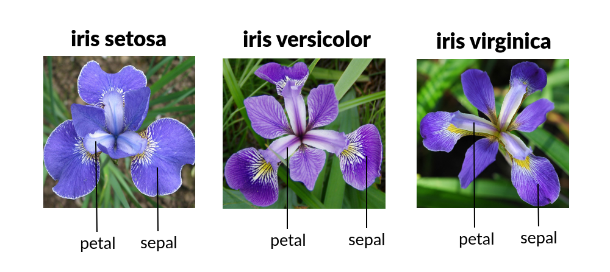
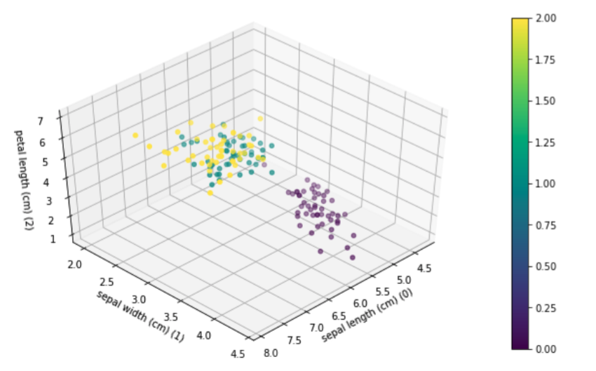
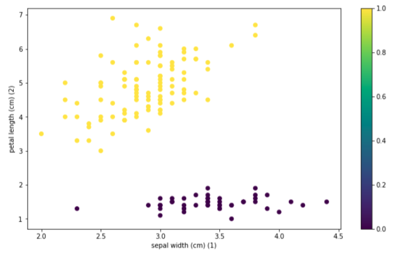
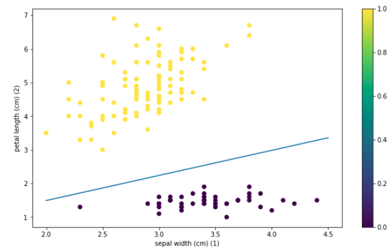
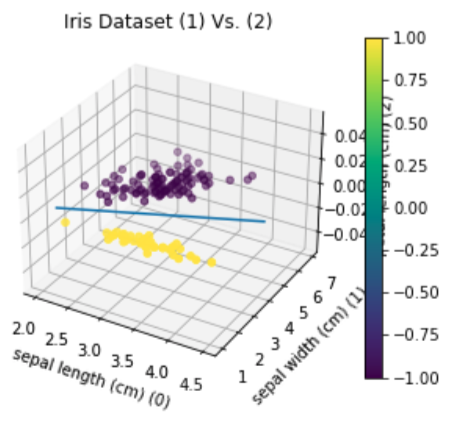

## Welcome
Neural Networks, are computational algorithms or models designed as per the structure of the human brain. In the Perceptron notebook we learned how to build simple neural networks "one-neuron networks". Where for each neuron, we trained the neuron (ie set the weights) by minimizing a different kind of loss function for each model. We built each neuron with the help of keras, and gradient descent to learn the weight.


## Iris dataset

The Iris dataset contains 3 classes with 50 instances each, where each class refers to a type of iris plant. One class is linearly separable from the other 2; the latter is not linearly separable from the others. We will be using each model to demonstrate how they can be used to linearly separate the two linearly separable classes.

### The two linearly Separable classes are sepal width (feature 1) and petal length (feature 2)

```
# What the Iris dataset looks like plotted 
    
from sklearn import datasets iris = datasets.load_iris() print(dir(iris))
import matplotlib.pyplot as plt from mpl_toolkits import mplot3d
    

fig = plt.figure()  
display(fig)  
ax = plt.axes(projection='3d')  
figiris = ax.scatter(iris.data[:,0],iris.data[:,1],iris.data[:,2],c=iris.target) 
ax.set_xlabel(iris.feature_names[1]+' (1)') 
ax.set_ylabel(iris.feature_names[2]+' (2)') 
ax.set_zlabel(iris.feature_names[0]+' (0))')
	
# this adjusts the space around the plot so we can read the z label 
plt.gcf().subplots_adjust(left=-0.5,bottom=-0.3)

plt.colorbar(figiris) 
ax.view_init(45,45)
```
    



## The Perceptron

 - The single layer perceptron is a feed-foward network based on threshold transfer function. The single layer perceptron is the simplist classifier and can only classify linearly seperable cases with a binary target. 
 - The input of a perceptron is typically a feature vector X multipled (dot product) by weight vector w and added to a bias b, where y = wx+b.  
 - A activation function or "threshold function" is used to classify the output. In the simple case of a unit step function, if output is greater than a defined threshold 0 we predict 1 and -1 else.

### Summary

 1. Randomly initalize the weighs  
 2. For each training sample: Calculate the output value and update the weights  
 3. The ouput value is the class label predicted by the activation function  
 4. The learning rate (rate at which weights are updated) is defined by w = w+a(target-output)X, where a is the learning rate, target is the true class label, and output is the predicted class label 5. All weights in the weight vector are updated simultaneously


<div class="ui small rounded images">
  
  
  
</div>

------------------------------ STEP 1 ------------------------------

### Create Model  
This model "perceptron" is made of a single layer with one neurons, of input dimension 2 and has a linear activation function (want the activation function to leave the dot product unchanged).
```python
perceptron = Sequential([ 
	Dense(1, input_shape=(2,)), 
	Activation('linear'),
])
```
------------------------------ STEP 2 ------------------------------

### Train the algorithm.  
The ramp loss we used is not predefined, so we define it ourselves here. The code here is tensorflow code as is required. We cannot use numpy code/data types here.
```python
from keras.optimizers import SGD 
def perceptron_loss(y_true,y_pred):
	tf.cast(y_true, tf.float32) 
	return(tf.maximum(0.0,-(y_true)*y_pred))
```
We want to do plain vanilla stochastic gradient descent here, nothing fancy. The call below removes all bells and whistles from the keras implementation of stochastic gradient descent. We will learn how to add back the momentum and Nesterov acceleration later.
```python
opt = SGD(lr=1,momentum=0,nesterov=False) 
``` 
Here we tell the perceptron to use plain vanilla stochastic gradient descent to optimize the perceptron loss defined above
```python
perceptron.compile(optimizer=opt, loss=perceptron_loss)
```
 ------------------------------ STEP 3 ------------------------------

### Prepare the training data by extracting columns 1 and 2 from the data.  
We want to separate out setosa (original label 0) from the other two classes, so we assign label 1 to setosas (original label 0) and -1 to the other two classes (original labels 1 and 2).
```python
training = iris.data[:,[1,2]]  
labels = np.where(iris.target == 0, 1,-1)

n = training.shape[0]  
```
We shuffle the order of the training examples and labels. Normally keras does this automatically. Here, we do it manually and we will ask keras not to shuffle. This is so that we can observe the perceptron algorithm as it progresses.
```python
from sklearn.utils import shuffle  
training, labels = shuffle(training, labels)
```
------------------------------ STEP 4 ------------------------------

### Use Keras to train the model  
and get the output at the end of the training into w from keras.callbacks import LambdaCallback
```python
import keras.backend as K  
```
We initialize weights to something a little away from 0, since the perceptron has 0 loss when the weights are exactly 0 regardless of input and output. This is because when weights are 0, w^Tz -b = 0^Tz -0 =0, so our prediction is 0. Therefore, y_true*y_predicted =0 always. This is not a fatal flaw, it just means we cannot start at 0.
```python
perceptron.layers[0].set_weights([np.array([[0.01],[0.01]]),np.array([0.0])])  
```
The line below trains the perceptron. In the line below, increase the number of epochs till you see the loss become 0. You may need more than one/two epochs.

```python
perceptron.fit(training, labels, epochs=2, batch_size=1, shuffle=False) 
```
These are weights obtained after training.
```python
w = perceptron.layers[0].get_weights()
```


## The Linear Regression classifier (Fisher Discriminant)

The simple Linear Regression method is a way to predict a target variable by fitting the best linear relationship between the dependent and independent variable. The line that best fits or minimizes the square loss is given by the equation (y_true - y_predicted)^2. The least squars method is done by making sure that the sum of all distances between the shape and the actual observations at each point is as small as possible. The fit of the shape is best when there is no other position that would produce less error given the choice of the shape.

------------------------------ STEP 1 ------------------------------

### Create Model  
This model "Fisher Discriminant" is made of a single layer with one neurons, of input dimension 2 and has a linear activation function (want the activation function to leave the dot product unchanged).
```python
model = Sequential([  
	Dense(1, input_shape=(2,)), 
	Activation('linear'),
])
```

------------------------------ STEP 2 ------------------------------

### Train the algorithm.  
keras implementation of stochastic gradient descent (Learning Rate = 0.01)
```python
sgd = SGD(lr=0.01,momentum=0,nesterov=False) 
```
Compiling model with "Mean Squared Error"
```python
model.compile(loss='mse', optimizer=sgd, metrics=['mse'])
```

------------------------------ STEP 3 ------------------------------

### Prepare the training data by extracting columns 1 and 2 from the data.  
We want to separate out setosa (original label 0) from the other two classes, so we assign label 1 to setosas (original label 0) and -1 to the other two classes (original labels 1 and 2).
```python
training = iris.data[:,[1,2]]  
labels = np.where(iris.target == 0, 1,-1)
```
We shuffle the order of the training examples and labels. Normally keras does this automatically. Here, we do it manually and we will ask keras not to shuffle. This is so that we can observe the fisher discriminant algorithm as it progresses.
```python
from sklearn.utils import shuffle  
training, labels = shuffle(training, labels)
```
Initalize weights
```python
model.layers[0].set_weights([np.array([[0.01],[0.01]]),np.array([0.0])]) 
```
------------------------------ STEP 4 ------------------------------

### Use Keras to train the model 
Trains model
```python
model.fit(training, labels, epochs=10, batch_size=1, shuffle=False) 
```
Output weights
```python
w = model.layers[0].get_weights() 
```

## Support vector machine

SVM works by creating a line which separates the classes in a classifcation problem. The goal of the line is to maximize the margin between the points on either sides of the "decision line". This seperation is done by minimizing the hinge loss = max(0, 1- y_true* y_predicted), but to the hinge loss, we add a (1/C)||w||^2 term, where C is some constant. In machine learning parlance, adding a ||w||^2 term to the loss is called l2 regularization. So this is a single neuron, linear activation, trained using hinge loss with l2 regularization.

------------------------------ STEP 1 ------------------------------

### Create Model

This model "SVM" is made of a single layer with one neurons, of input dimension 2 and has a linear activation function (want the activation function to leave the dot product unchanged). A regularization is used in this model to apply penalties on layer parameters during optimization. This helps to prevent over fitting by penalizing a model for having large weights.
```python
model = keras.models.Sequential([  
	keras.layers.Dense(1, activation='linear', input_shape=(2,), kernel_regularizer=keras.regularizers.l2(l=0.1)),
])
```
------------------------------ STEP 2 ------------------------------

### Train the algorithm.  
keras implementation of stochastic gradient descent (Learning Rate = 0.01)
```python
sgd = SGD(lr=0.01,momentum=0,nesterov=False) 
```
Compiling model with "hinge loss"
```python
model.compile( 
	optimizer=keras.optimizers.Adam(learning_rate=0.01), 
	loss=keras.losses.hinge, 
	metrics=[keras.metrics.CategoricalAccuracy(name="acc")],
)
```
------------------------------ STEP 3 ------------------------------

### Prepare the training data by extracting columns 1 and 2 from the data.  
We want to separate out setosa (original label 0) from the other two classes, so we assign label 1 to setosas (original label 0) and -1 to the other two classes (original labels 1 and 2).
```python
training = iris.data[:,[1,2]]  
labels = np.where(iris.target == 0, 1,-1)
```
We shuffle the order of the training examples and labels. Normally keras does this automatically. Here, we do it manually and we will ask keras not to shuffle. This is so that we can observe the SVM algorithm as it progresses.
```python
from sklearn.utils import shuffle  
training, labels = shuffle(training, labels)
```
Initalize weights
```python
model.layers[0].set_weights([np.array([[0.01],[0.01]]),np.array([0.0])])
```
 ------------------------------ STEP 4 ------------------------------

### Use Keras to train the model 
Trains model
```python
model.fit(training, labels, epochs=5, batch_size=1, shuffle=False)
```
Output weights
```python
w = model.layers[0].get_weights()
```
