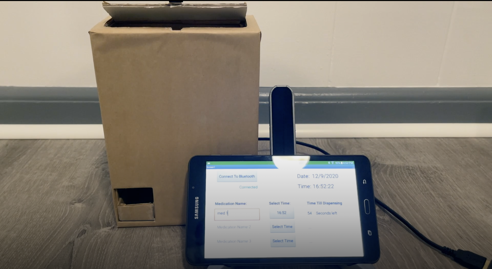
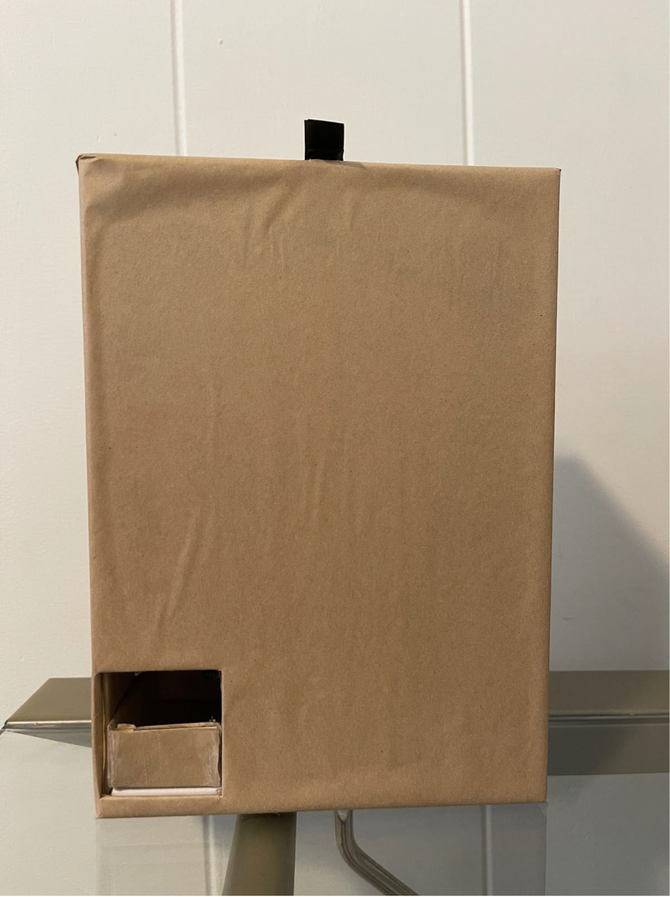
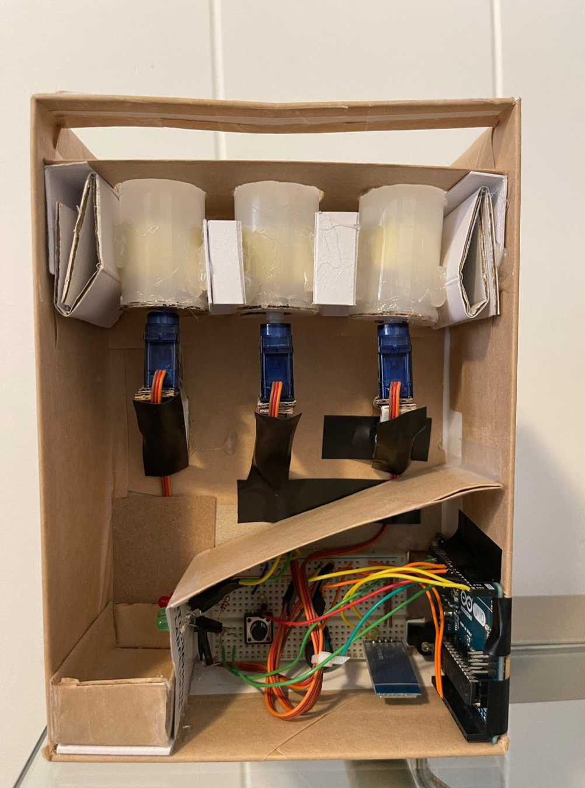
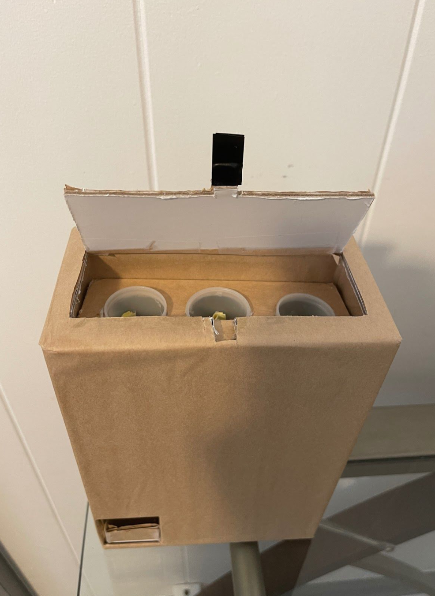

  
  
  

## Automatic Pill Dispenser
 - Designed and developed an automatic pill dispenser to allow users to organize and manage their medication safely.
 - Skills: Object Orientated Programming (C++), Arduino, MIT App inventor, BLE.
    
## Description:
The automatic pill dispenser was an individual project created by Tyler Baguio for his EE 296 course. As it is an individual project, Tyler was the creator, designer, programmer, leader, and concept creator. The project has three main components: the corresponding app, the physical project, and the Microcontroller (Arduino Uno). The App was created using MIT App inventor and allows the user to connect to the physical project which they can then use to enter the specific time. While the Arduino is physically attached to the project and receives the signals from the app to follow a certain function for specific outputs. The concept of the project was inspired by my grandparents who have to take medication daily. However, the audience can be anyone who has to take medication (specifically for those with dementia).

## Skills:

 - Object Orientated Programming (C++)
 - Understanding of Arduino Uno/IDE
 - Understanding of electrical components (BLE, Piezoelectric speaker, LED, Servo, Switches, etc...)
 - Critical Thinking
 - Cost/Quality Management
 - Adaptability
 - Problem solving

