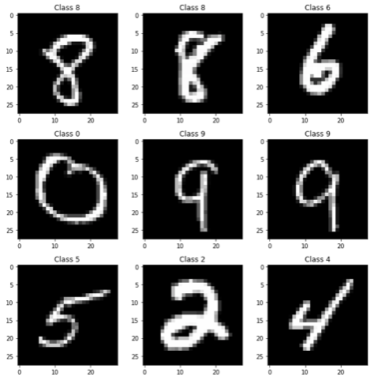
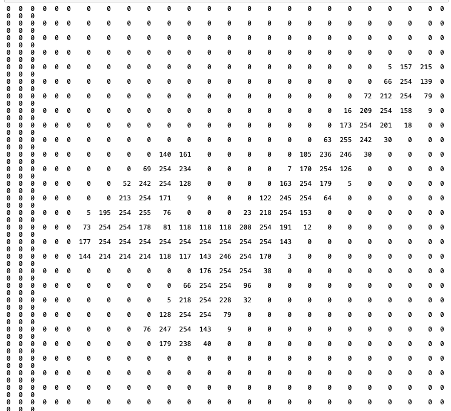
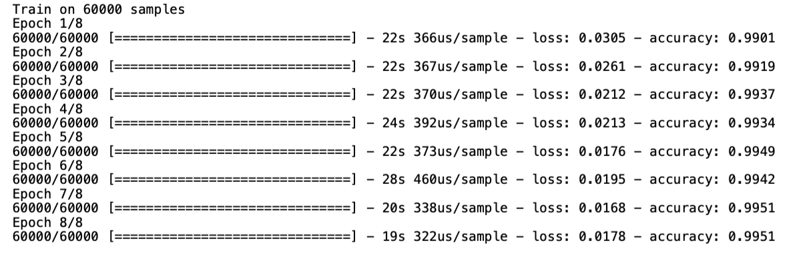
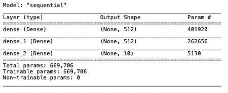
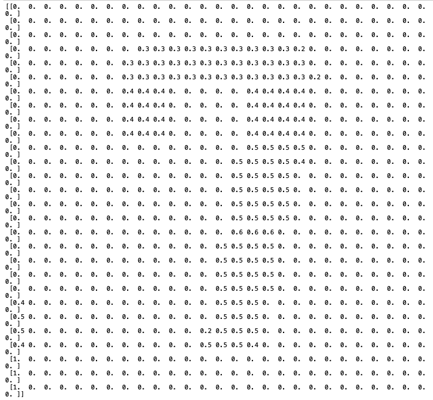
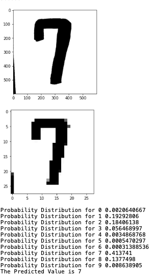

## Introduction
This project was created as a self guided learning experience to gain a better understanding of using keras and the MNSIT dataset to create machine learning models. 

## MNSIT DATASET
MNIST contains 70,000 images of hand-written digits, each 28 x 28 pixels, in greyscale with pixel-values from 0 to 255.

We will build a feedforward neural network and train it to solve a real problem with Keras.

**Problem**: Given an image, classify it as a digit (0-9)  
**Solution**: We’ll flatten each 28x28 into a 784 dimensional vector, which we’ll use as input to our neural network. Our output will be one of 10 possible classes: one for each digit.

## Creating the model

### Getting the data
First we load the data into our program. The data contains 70,000 images of hand-written digits, each 28 x 28 pixels, in greyscale with pixel-values from 0 to 255. We can separate this into training and testing datasets. We first allocate 60,000 (60,000,28,28) to the training dataset and 10,000 (10,000,28,28) to the testing dataset. 

### Visualizations
Each handwritten number comes with a label that is used to determine the number in the photo. This label will never been seen by the computer, except for when testing the models accuracy, and to adjust weights to decrease our loss.


To gain an understanding of what the computer see's, we will print the number 4 (Lower right hand corner). This image is a 28x28 matrix with values from 0-255 which indicate its color. 




### Preparing the data

Now, we need to flatten each image before we can pass it into our neural network. Instead of a 28 x 28 matrix, we build our network to accept a 784-length vector.

Each image needs to be then reshaped (or flattened) into a vector. We'll also normalize the inputs to be in the range [0-1] rather than [0-255] to make our network easier to train.

### Building the model
Every Keras model is either built using the Sequential class, which represents a linear stack of layers, or the functional Model class, which is more customizeable. We’ll be using the simpler Sequential model, since our network is indeed a linear stack of layers.

We start by instantiating a Sequential model:  

-   The Sequential constructor takes an array of Keras layers. Since we’re just building a standard feedforward network, we only need the Dense layer.
    
    -   Feedfoward : information flows through the function being evaluated from x, through the intermediate computations used to define f, and finally to the output y. ... There are no feedback connections in which outputs of the model are fed back into itself.
    -   Dense Layer (output = activation(dot(input, kernel) + bias)) : Each neuron in a layer receives an input from all the neurons present in the previous layer—thus, they're densely connected. In other words, the dense layer is a fully connected layer, meaning all the neurons in a layer are connected to those in the next layer. Dense layers also applies operations like rotation, scaling, translation on the vector.
-   The first two layers have 64 nodes each and use the ReLU activation function. The last layer is a Softmax output layer with 10 nodes, one for each class.
    
    -   Relu activation: A piecewise linear function that will output the input directly if it is positive, otherwise, it will output zero. The rectified linear activation function overcomes the vanishing gradient problem, allowing models to learn faster and perform better.
    -   Softmax: turns arbitrary real values into probabilities. (Highest number is the most likely its the number)
```python
from tensorflow.keras.models import Sequential
from tensorflow.keras.layers import Dense

model = Sequential([
  Dense(512, activation='relu', input_shape=(784,)),
  Dense(512, activation='relu'),
  Dense(10, activation='softmax'),
])
```

### Compiling the Model

Before we can begin training, we need to configure the training process. We decide 3 key factors during the compilation step:

-   The optimizer : The Adam gradient-based optimizer.
-   The loss function : Since we’re using a Softmax output layer, we’ll use the Cross-Entropy loss. Keras distinguishes between binary_crossentropy (2 classes) and categorical_crossentropy (>2 classes), so we’ll use the latter
-   A list of metrics. Since this is a classification problem, we’ll just have Keras report on the accuracy metric.

```python
model.compile(
  optimizer='adam',
  loss='categorical_crossentropy',
  metrics=['accuracy'],
 )
 ```
 
### Testing model
Using Keras model.fit() we can measure how well the model generalizes to similar data to that on which it was trained. A well-fitted model produces a more accurate outcome. One that is over fitted matches the data too closely, vice versa to one that is under fitted. 

Of the 60,000 testing images, we can see that we achieved a loss of 0.0178 and an accuracy of 0.9951 with 8 epochs. 


### Summary of model


## Using the Model
To allow the computer to process an image we will be using OpenCV which is aimed mainly for real-time computer vision. 

After loading in our model, we can turn the image from color to black and white since no important information will be lost. We also decrease the dimensionality of the image from its resolution (600x600 shown in photo) to an 28x28 pixel image. Next, we normalize the data and run it through our model. 




Shown below the model accurately predicts this number to be a 7



