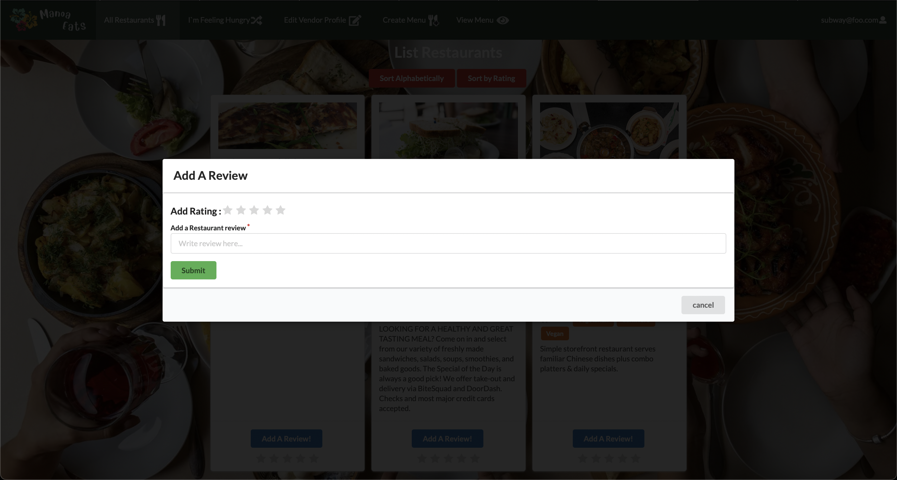

### Please see [Manoa Eats GitHub organization page](https://manoa-eats.github.io) for more information on project. 

## Overview:
Manoa Eats is a web application that will allow students and staff access to the different eateries information on campus. When they visit our landing page they will notice a search bar in the middle of the page and a column of the left of the page giving the different restaurants that are currently open. At the top of the page there will be several different tabs which include an All Restaurants tab and I’m Feeling Hungry tab. Once the user signs in or creates an account they will able to have access to a reviews tab.

## The Problem
Not many students know about all of our fine dish eateries on the UH Manoa campus. In addition, some students who want to try new restaurants may not get a chance to because they may have time conflicts with their schedule leaving some restaurants having either too many students in line or not enough students.

## The Solution
Manoa Eats will allow hardworking students to nourish their brains with UH’s nutritious food located all around the campus. Students will be able to upload their schedules along with their course locations, and our website will estimate the best restaurant locations to stop at on their path to their next class.

## Contributions
My contributions included creating the initial mockups for some pages of Manoa Eats. In addition to the following Pages (Pages shown Below):
- Admin Verification page 
- All Restaurant Page
 
Additionally, I integrated TestCafe throughout the project to ensure that all pages displayed and forms worked for the correct input in your application. Our final project implements continuous integration using GitHub Actions. I also worked on the star rating reviews shown on the vendor page, created the modal "add a review" for the vendor, and cleaned the code from any broken or useless code. 

## Academic Discoveries 
This project taught me many things, from performing agile project management using Github and issue-driven project management—to learning new languages, including Javascript, CSS, and HTML. In addition to frameworks such as Meteor and Semantic UI React, backend cross-platform document-oriented database program MongoDB, and how to design and implement effective test suites using Testcafe. However, the most important lesson that I took from this project was the agile project management approach aimed at the continuous release of the project in iterations throughout its life cycle. This approach, combined with the issue-driven project management style, taught me how to work with a team using online resources and organize the team so that a large project can be broken into tasks and each task can be pushed to the main project without much conflicts. 

# Manoa Eats Page Screenshots

## Admin Verification Page

## All Restaurants Page

## Review Modal in restaurants card

